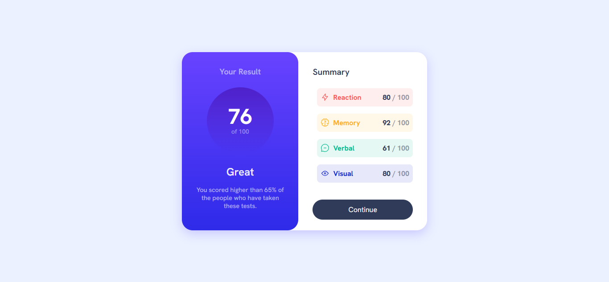

# Frontend Mentor - Results summary component solution

This is a solution to the [Results summary component challenge on Frontend Mentor](https://www.frontendmentor.io/challenges/results-summary-component-CE_K6s0maV). Frontend Mentor challenges help you improve your coding skills by building realistic projects. 

## Table of contents

- [Overview](#overview)
  - [The challenge](#the-challenge)
  - [Screenshot](#screenshot)
  - [Links](#links)
- [My process](#my-process)
  - [Built with](#built-with)
  - [What I learned](#what-i-learned)
  - [Useful resources](#useful-resources)
- [Author](#author)

## Overview

### The challenge

Users should be able to:

- View the optimal layout for the interface depending on their device's screen size
- See hover and focus states for all interactive elements on the page
- **Bonus**: Use the local JSON data to dynamically populate the content

### Screenshot

### Links

- Solution URL: [Add solution URL here](https://your-solution-url.com)
- Live Site URL: [Add live site URL here](https://your-live-site-url.com)

## My process

### Built with

- Semantic HTML5 markup
- CSS custom properties
- Flexbox
- Mobile-first workflow

### What I learned
- Structure a two-column layout
- Use flexbox to position and align content responsively.

### Useful resources

- [Flexbox froggy](https://flexboxfroggy.com/) - a fun game to master Flexbox:
- [MDN CSS Layout Guides](https://developer.mozilla.org/en-US/docs/Learn/CSS/CSS_layout) - the official, detailed reference

## Author

- Frontend Mentor - [@appianing-gideon](https://www.frontendmentor.io/profile/appianing-gideon)
- LinkedIn - [Gideon Appianing](https://www.linkedin.com/in/gideon-appianing-9660b736b/?lipi=urn%3Ali%3Apage%3Ad_flagship3_feed%3BZGHzgn6kR%2BiFUn9PZmRATQ%3D%3D)

